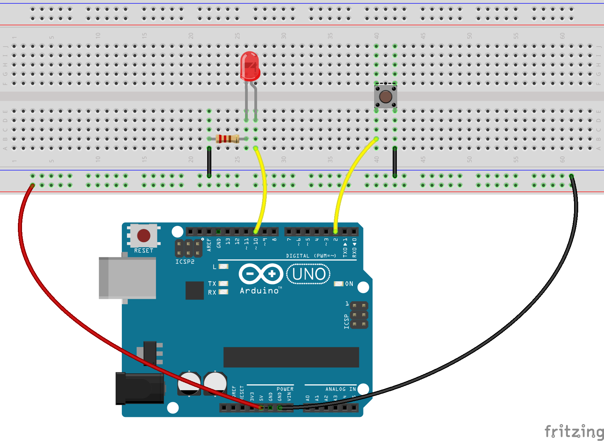
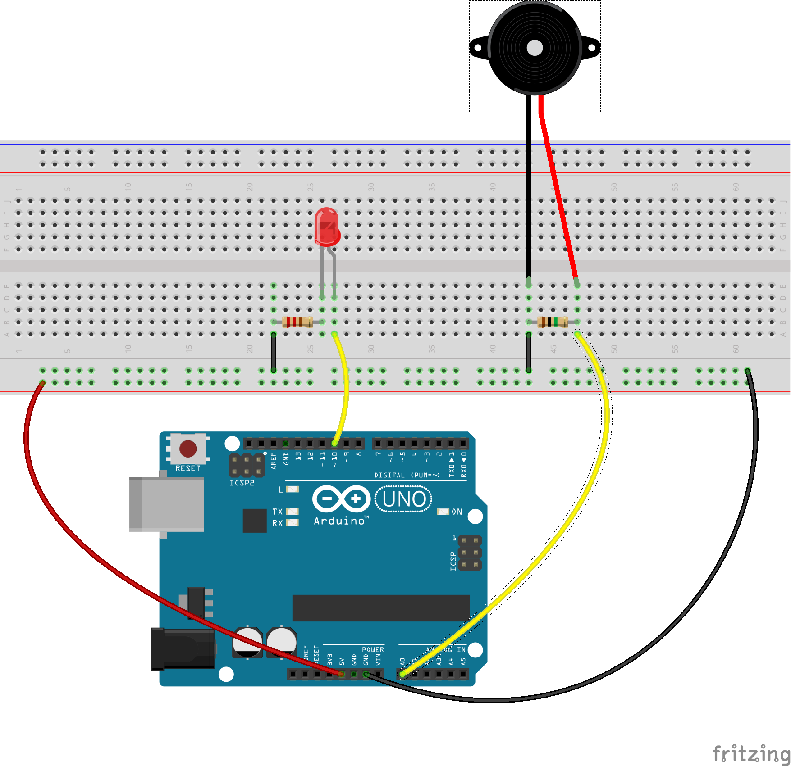

# Introduktion till Arduino - Hemlig knackning

Här är en beskrivning av hur man kan bygga ett system som känner av när man knackat på ett visst sätt och bara då låser upp en dörr (eller öppnar en låda eller vad man nu vill ska hända).

Beskrivningen riktar sig till nybörjare på så sätt att den börjar med grundläggande funktionalitet som steg-för-steg byggs på, lite i taget.

Det är dock bra med viss förkunskap så som

  - hur man kopplar på ström, 
  - hur man laddar ner program till Arduinon
  - vad funktionerna ```setup()``` och ```loop()``` gör.
  - lite om motstånd (resistorer) och deras färgkodning
  - hur kopplingsplattan fungerar

Det finns gott om information om det på nätet - eller fråga någon i din närhet!  

För detta projekt behövs

  - En Arduino 
  - En kopplingsplatta
  - En LED lampa
  - Motstånd
    - 1 st 220Ω
    - 1 st 1MΩ
  - Div kopplingssladdar
  - Piezomikrofon
  - (listan kommer färdigställas när sista punkten är avklarad och beskrivningen är komplett)

Lista över alla steg:

  1. [Tryck på en knapp - säg till Arduinon att tända lampan.](#section_1)
  1. [Knacka - lampan blinkar till.](#section_2)
  1. [Knacka - lampan lyser en liten stund.](#section_3)
  1. [Knacka 2 gånger - tänd lampan lika länge](#section_4)
  1. [Knacka flera gånger - tänd lampan när man slutat](#section_5)
  1. [Spela upp knackningar med lampan.](#section_6)
  1. [Spela upp och spara knackningar - men bara om en knapp trycks ner](#section_7)
  1. [Jämför knackningar med sparad inspelning. Tänd lampan om de stämmer](#section_8)
  1. [Koppla på motor...](#section_9)

## <a name="section_1"></a>1. Tryck på en knapp - säg till Arduinon att tända lampan.
Introduktion till Arduino.

När knappen trycks ner skickas en signal till Arduinon på pinne 2.

Programmet i Arduinon känner av när pinne 2 får en signal och skickar då ut en signal till pinne 10.


*Knappen är kopplad till pinne 2 och till GND.*<br>
*Lampan är kopplad till pinne 10 och till GND via ett 220Ω motstånd.*


Programmet:
```arduino

// Konstanter
const int pinne_lampa = 10;
const int pinne_knapp = 2;

// Variabler
bool lampan_lyser = false;

// Funktioner
void setup()
{
    pinMode(pinne_knapp, INPUT_PULLUP);
    pinMode(pinne_lampa, OUTPUT);    
}

void loop()
{
    bool lampan_ska_lysa = lampan_lyser;

    if (digitalRead(pinne_knapp) == LOW) // Är knappen nere?
    {
        lampan_ska_lysa = true;
    }
    else
    {
        lampan_ska_lysa = false;
    }

    if (lampan_lyser != lampan_ska_lysa)
    {
        if (lampan_ska_lysa)
            digitalWrite(pinne_lampa, HIGH);  // Tänd lampan
        else
            digitalWrite(pinne_lampa, LOW);  // Släck lampan

        lampan_lyser = lampan_ska_lysa;
    }
}
```

## <a name="section_2"></a>2. Knacka - lampan blinkar till.
Istället för en knapp som i steg 1 så används en mikrofon.


*Mikrofonen är kopplad till A0 och GND, parallellt med ett 1MΩ motstånd.*<br>
*Lampan är kopplad till pinne 10 och till GND via ett 220Ω motstånd.*

Utifrån hur starkt ljudet är får man ett signalvärde på mellan 0 och 1024, där 0 alltså betyder att den inte känner av något alls och 1024 är det starkaste.

För att inte varenda litet ljud ska störa kan man sätta ett gränsvärde och inte bry sig om ljud som är svagare än det. I programmet anger konstanten ```gransvarde``` gränsvärdet.

```arduino

// Konstanter
const int gransvarde = // Välj ett lagom gränsvärde - prova dig fram. 
const int pinne_lampa = 10;
const int pinne_mikrofon = 0; // Pinne A0 på kortet.

// Variabler
bool lampan_lyser = false;

// Funktioner
void setup()
{
    pinMode(pinne_mikrofon, INPUT_PULLUP);
    pinMode(pinne_lampa, OUTPUT);    
}

void loop()
{
    bool lampan_ska_lysa = lampan_lyser;

    if (analogRead(pinne_mikrofon) > gransvarde) // Låter det tillräckligt?
    {
        lampan_ska_lysa = true;
    }
    else
    {
        lampan_ska_lysa = false;
    }

    if (lampan_lyser != lampan_ska_lysa)
    {
        if (lampan_ska_lysa)
        {
            digitalWrite(pinne_lampa, HIGH);  // Tänd lampan
        }
        else
        {
            digitalWrite(pinne_lampa, LOW);  // Släck lampan
        }

        lampan_lyser = lampan_ska_lysa;
    }
}
```

## <a name="section_3"></a>3. Knacka - lampan lyser en liten stund.

När man kör programmet ovan lyser bara lampan så länge Arduinon tar mot ljudet, för en knackning är det förstås väldigt kort tid, 
man hinner knappt se att lampan lyser överhuvudtaget.

Kan man kanske få lampan att lysa lite längre?

Till sin hjälp kan man använda funktionen ```millis()```. 

Den ger hur många *millisekunder* som gått sedan Arduinon startats. Det går 1000 millisekunder på en sekund.

Med hjäp av den kan man se till att lampan släcks ett visst antal millisekunder efter att den tänts.

```arduino
// Konstanter
const unsigned long lampans_lystid = ?; // Hur många millisekunder ska lampan lysa?
const int gransvarde = 100;

const int pinne_lampa = 10;
const int pinne_mikrofon = 0; // Pinne A0 på kortet.

// Variabler
unsigned long dags_att_slacka_lampan = 0;

// Funktioner
void setup()
{
    pinMode(pinne_lampa, OUTPUT);    
}

void loop()
{
    const unsigned long tid_nu = millis();

    if (analogRead(pinne_mikrofon) > gransvarde) // Låter det tillräckligt?
    {
        digitalWrite(pinne_lampa, HIGH);  // Tänd lampan
        dags_att_slacka_lampan = tid_nu + lampans_lystid;
    }

    if (dags_att_slacka_lampan>0 && tid_nu >= dags_att_slacka_lampan)
    {
        digitalWrite(pinne_lampa, LOW);  // Släck lampan
        dags_att_slacka_lampan = 0;
    }
}
```

## <a name="section_4"></a>4. Knacka 2 gånger - tänd lampan lika länge

Hur lång tid är det mellan två knackningar?

Nästa steg är att lista ut just det, det kommer vara användbart sedan när vi ska känna av om man knackat rätt.

Även här kan man ha nytta av funktionen ```millis()```.

Genom att anropa ```millis()``` två gånger och ta det *andra* värdet *minus* det *första* får man alltså svaret på hur många millisekunder som gått mellan de två anropen.

Det kan man använda när man ska räkna ut tiden mellan knackningarna.

```arduino
// Konstanter
const int gransvarde = 5;
const int pinne_lampa = 10;
const int pinne_mikrofon = 0; // Pinne A0 på kortet.


// Variabler
unsigned long dags_att_slacka_lampan = 0;
unsigned long knacktid1 = 0; // Håller reda på den första knackingens tid
unsigned long knacklangd = 100; 

unsigned long next_debug_print = 0;
// Funktioner
void setup()
{
    pinMode(pinne_lampa, OUTPUT);    
}

void loop()
{
    const unsigned long tid_nu = millis();

    if(next_debug_print == 0) next_debug_print = tid_nu + 500;
      
    if (dags_att_slacka_lampan == 0)
    {
      if (analogRead(pinne_mikrofon) > gransvarde) // Låter det tillräckligt?
      {
          if (knacktid1 == 0)
          {
            // Vi har ingen tid för första knackingen sedan tidigare
            // alltså är detta första knackningen.
  
            knacktid1 = tid_nu;
            dags_att_slacka_lampan = tid_nu + knacklangd;
            digitalWrite(pinne_lampa, HIGH);  // Tänd lampan liten stund för att visa att Arduninon hört knacket
          }
          else 
          if (tid_nu > knacktid1 + knacklangd) // Testa att ta bort denna rad. Vad händer? Varför?
          {
            // Vi hade redan sparat tiden för första knackningen, då
            // är detta andra knackningen.
            const unsigned long knacktid2 = tid_nu;
  
            const unsigned long tid_mellan_knackningrna = knacktid2 - knacktid1;
  
            dags_att_slacka_lampan = tid_nu + tid_mellan_knackningrna;
            digitalWrite(pinne_lampa, HIGH);  // Tänd lampan
            knacktid1 = 0;
          }
      }
    }

    if (tid_nu > next_debug_print){
      next_debug_print = 0;
    }
    if (dags_att_slacka_lampan>0 && tid_nu >= dags_att_slacka_lampan)
    {
        digitalWrite(pinne_lampa, LOW);  // Släck lampan
        dags_att_slacka_lampan = 0;
    }
}
```

## <a name="section_5"></a>5. Knacka flera gånger - tänd lampan när man slutat

Hur vet man när det knackats färdigt? 

Det är när det varit tyst tillräckligt länge.

Vad är tillräckligt länge? 

Vad tycker du?

```arduino
// Konstanter
const int gransvarde = 5;
const int pinne_lampa = 10;
const int pinne_mikrofon = 0; // Pinne A0 på kortet.
const unsigned long vante_tid = ?; // Hur länge ska man vänta?
const unsigned long lys_tid = ?; // Så länge lyser lampan

// Variabler
unsigned long dags_att_slacka_lampan = 0;
unsigned long senaste_knacktid = 0; 

// Funktioner
void setup()
{
    pinMode(pinne_lampa, OUTPUT);    
}

void loop()
{
    const unsigned long tid_nu = millis();

    if (analogRead(pinne_mikrofon) > gransvarde) // Låter det tillräckligt?
    {
        senaste_knacktid = tid_nu;
    }

    if (senaste_knacktid > 0)
    {
      if (tid_nu > senaste_knacktid + vante_tid)
      {
        senaste_knacktid = 0;
        dags_att_slacka_lampan = tid_nu + lys_tid;
        digitalWrite(pinne_lampa, HIGH);  // Tänd lampan
      }
    }

    if (dags_att_slacka_lampan>0 && tid_nu >= dags_att_slacka_lampan)
    {
        digitalWrite(pinne_lampa, LOW);  // Släck lampan
        dags_att_slacka_lampan = 0;       
    }
}
```

## <a name="section_6"></a>6. Spela upp knackningar med lampan.

  1. Efter varje knack (förutom det första) [spara undan hur lång tid det var till foregående knack.](#section_6_1)
  1. [Efter sista knackningen](#section_6_2), låt lampan lysa utifrån de [sparade tiderna](#section_6_3).


### <a name="section_6_1"></a> 6.1. Spara undan hur lång tid det var till foregående knack.

Till detta kan man ha en hel lista av värden i en enda variable, en sk *array* eller *vektor*.

Exempel:
```arduino
unsigned long tider[3];
```

Variabeln ```tider``` har plats för 3 stycken ```unsigned long``` värden. Den första har index 0.
Exempel:
```arduino
unsigned long tider[3];

tider[0] = 123;
tider[1] = 456;
tider[2] = 789;
```

I ```tider``` ovan får det alltså plats 3 tidsvärden. Är det lagom? Hur många knackningar vill man kunna hantera som mest?

### <a name="section_6_2"></a> 6.2. Efter sista knackningen

Hur vet man att det är den sista knackning? Se Steg 5 ovan.

### <a name="section_6_3"></a> 6.3. Gå igenom sparade knacktider

Gå igenom sparade knacktider och låt lampan lysa så länge som varje knackning varat, glöm inte släcka lampan en liten stund mellan varven.

Till detta kan man använda ```for``` uttrycket. Det kan användas till att räkna upp en variablel, t.ex. från 0 till ```antalet_knackning_som_sparats```.
Exempel:
```arduino
unsigned long tider[15];
int antalet_knackning_som_sparats = 5;

// ...

for(int i=0; i < antalet_knackning_som_sparats; i++)
{
  unsigned knacktid = tider[i];
  // ...
}

```

## <a name="section_7"></a>7. Spela upp och spara knackningar - men bara om en knapp trycks ner

## <a name="section_8"></a>8. Jämför knackningar med sparad inspelning. Tänd lampan om de stämmer

Hur lika är tiderna?

Hur fel får det vara men ändå räknas som rätt?

## <a name="section_9"></a>9. Koppla på motor...
